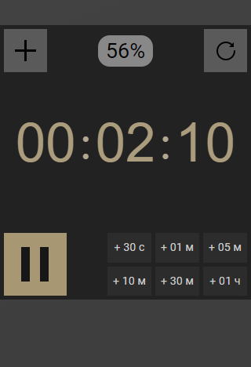

<h1 align="center">Таймер</h1>

<p align="center">
    
</p>
<h2 align="center"><a href="http://timer.mikhaili.infinityfreeapp.com" target="_blank" rel="noreferrer">Демо</a></h2>

## Описание
Представляю вам простой таймер, написанный на React. Он имеет режим два режима работы: уменьшения и увеличения, а также некоторые особенности.

### Режим увеличения
При активации значение таймера увеличивается. Интерфейс содержит кнопки: 

* запуска/остановки 
- обнуления с остановкой
+ изменения режима 

Также есть возможность прямого ввода чисел.

<p align="center">
    
</p>

### Режим уменьшения
При активации значение таймера уменьшается. Интерфейс содержит тот же функционал, что и в режиме увеличения, а также кнопки добавления времени. Помимо этого в начале отсчёта появляется показатель процентов, отображающий, какая часть интервала времени была пройдена.

<p align="center">
    
</p>

## Некоторые детали

### Гибкость табло
При вводе значений, превышающих лимит (больше 59 минут или секунд), таймер не обрезает эти значения до 59, а *учитывает их в следующих показателях*. Например, если ввести "77" в поле минут, то значение часа увеличится на 1, и значение минут увеличится на 17.

### Горячие клавиши
Функционал некоторых кнопок интерфейса повторяют клавиши:
* _Space_ -- запустить/остановить таймер 
- _Escape_ -- обнулить таймер

### Осведомлённость из других вкладок браузера
Счётчик отображается как название сайта, благодаря чему переключившись на другую вкладку можно отслеживать его значение.


## Зависимость от дисплея

### Подсветка кнопок для **touch** (`max-width: 1100px`)
В случае, если ширина устройства не превосходит 1100px, включается режим поддержки touch-устройств, при котором подсветка кнопок происходит не при наведении, а при нажатии с помощью псевдокласса `:active`.

### Изменение дизайна (`max-width: 400px`)
При маленькой ширине дисплея в режиме уменьшения изменён дизайн для корректного отображения.

<p align="center">
    
</p>

## Установка и запуск

```bash
npm install
npm run start
```

## Лицензия
На представленных изображениях и гиф используются 
<a target="_blank" href="https://icons8.com/icon/18784/time" rel="noreferrer">Time</a> и 
<a target="_blank" href="https://icons8.com/icon/90922/reboot" rel="noreferrer">Reboot</a> икнонки с сайта 
<a target="_blank" href="https://icons8.com" rel="noreferrer">Icons8</a>
